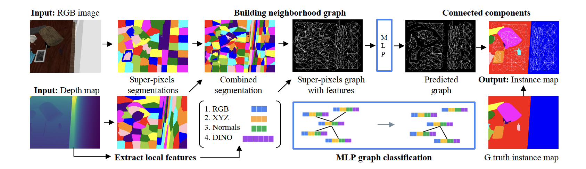

# SupeRGB-D: Zero-shot Instance Segmentation 
This is the official PyTorch implementation for [SupeRGB-D: Zero-shot Instance Segmentation in Cluttered Indoor Environments](https://arxiv.org/abs/2212.11922), [IEEE RAL paper](https://ieeexplore.ieee.org/document/10111059).

In this work, we explore zero-shot instance segmentation (ZSIS) from RGB-D data to identify unseen objects in a semantic category-agnostic manner. We introduce a zero-shot split for Tabletop Objects Dataset (TOD-Z) to enable this study and present a method that uses annotated objects to learn the ``objectness'' of pixels and generalize to unseen object categories in cluttered indoor environments.

<p align="center">
  
</p>

Our method, SupeRGB-D, groups pixels into small patches based on geometric cues and learns to merge the patches in a deep agglomerative clustering fashion. An overview of our method is illustrated here:
<p align="center">
  
</p>

## Setup

1. Python environment using env.yml.
```
    git clone https://github.com/evinpinar/supergb-d.git
    cd supergb-d
    conda env create --file env.yml
    conda activate supergbd
```

2. Install the TOD dataset from [original repo](https://drive.google.com/uc?export=download&id=157nWfb4pLbwAfOdMLls6q0lZQyqUCvLY) and the TOD-Z ids from [here](https://drive.google.com/file/d/1vkGmioePVXOw7CdoHWvhEM3oStCH-88v/view?usp=sharing). Preprocess the data to extract superpixels, training features and generate the ground truth. Fix the datapaths according to your local configuration.
```
    python data/preprocess_data_full.py # set up the number of threads according to your cpu
    # optionally, you can also only run data/process.py for single thread. 
```

3. Train the merger network.
```
    python src/model_train.py --cfg configs/run_local.yaml
```
4. Test the trained model.
```
    python src/model_eval.py --cfg configs/run_local.yaml
```

An example checkpoint is provided [here](https://drive.google.com/file/d/172wKBgY4x-cWU5orymJqjOkjFiP0QORX/view?usp=sharing) which is based on 128 super-pixels and trained without DINO features.

## Citation

If you find this code helpful, please consider citing:
```
@misc{ornek23,
  url = {https://arxiv.org/abs/2212.11922},
  author = {{\"O}rnek, Evin P{\i}nar and Krishnan, Aravindhan K and Gayaka, Shreekant and Kuo, Cheng-Hao and Sen, Arnie and Navab, Nassir and Tombari, Federico},
  title = {SupeRGB-D: Zero-shot Instance Segmentation in Cluttered Indoor Environments},
  publisher = {arXiv},
  year = {2022},
  copyright = {Creative Commons Attribution 4.0 International}
}
```

## Acknowledgements

This repository contains code parts that are based on [UOIS-Net](https://github.com/chrisdxie/uois) and [Davis-2017](https://github.com/davisvideochallenge/davis-2017). We thank the authors for making their code available.
